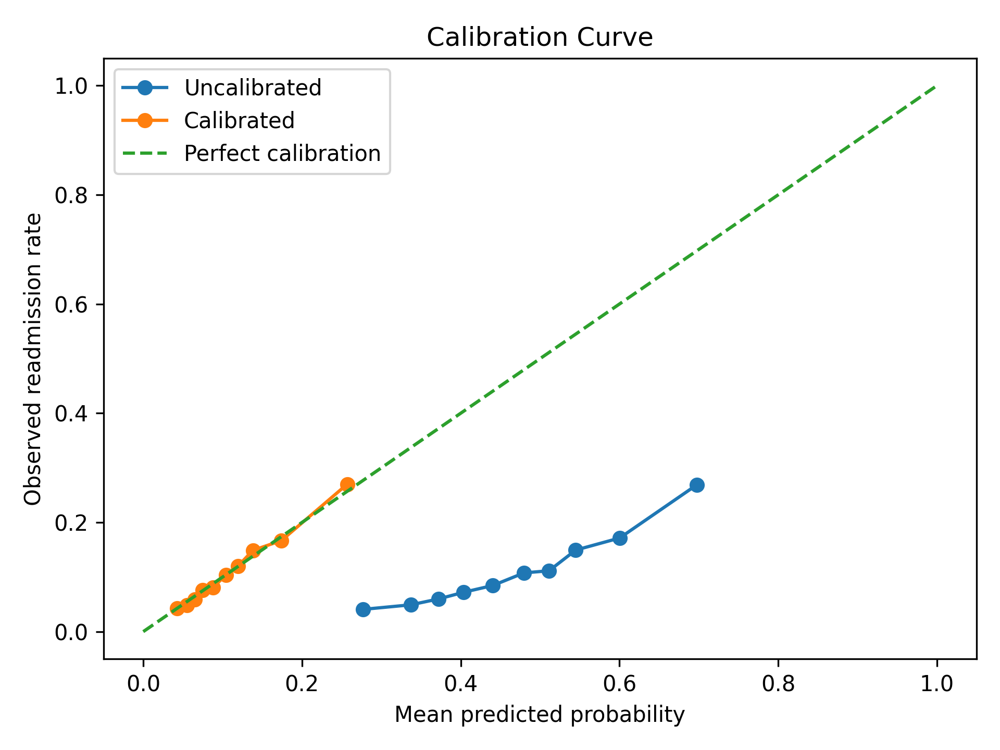
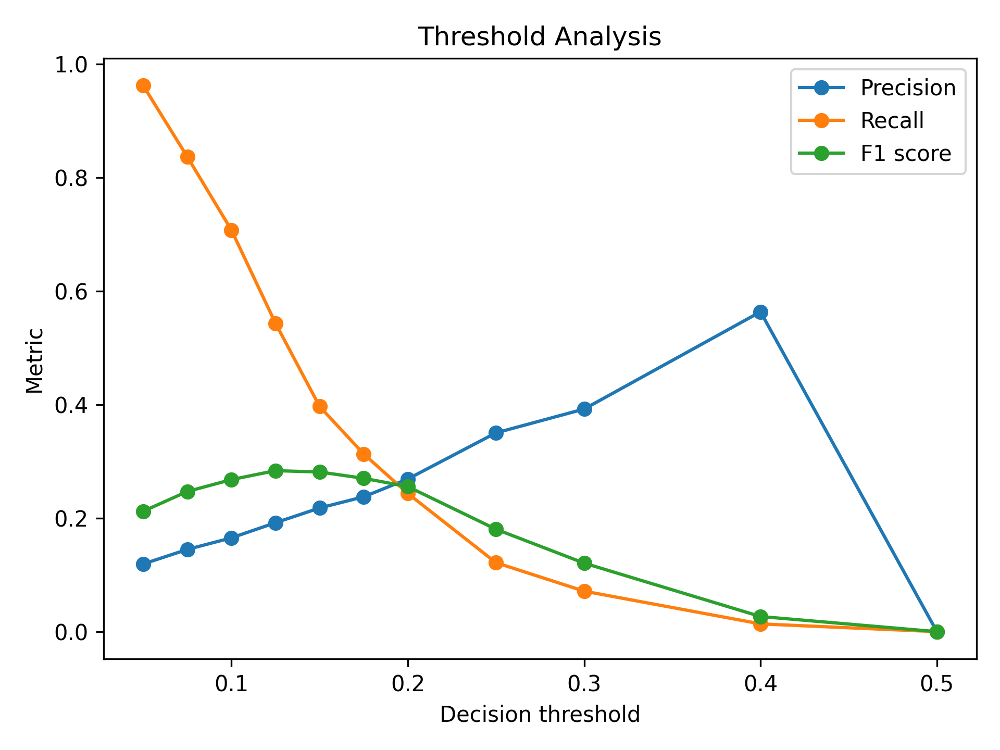
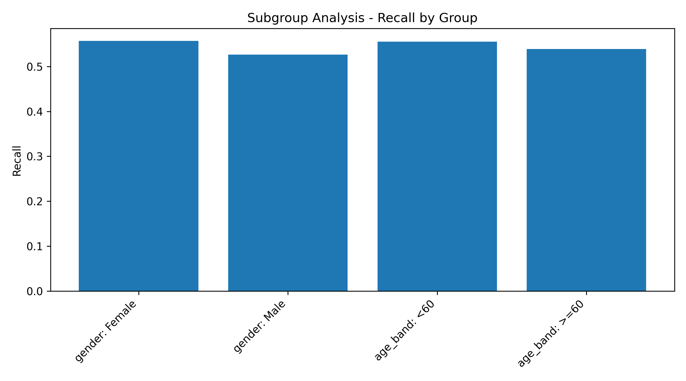
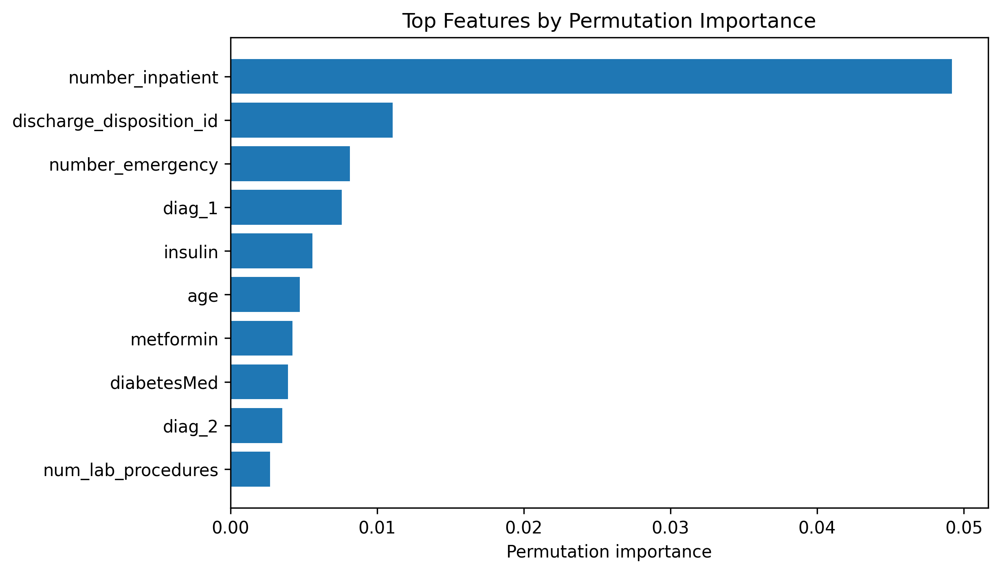
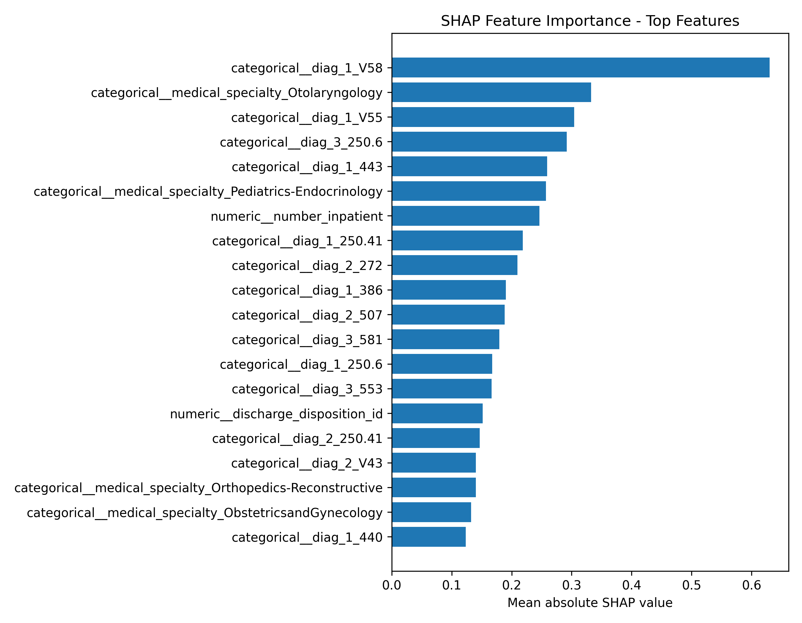
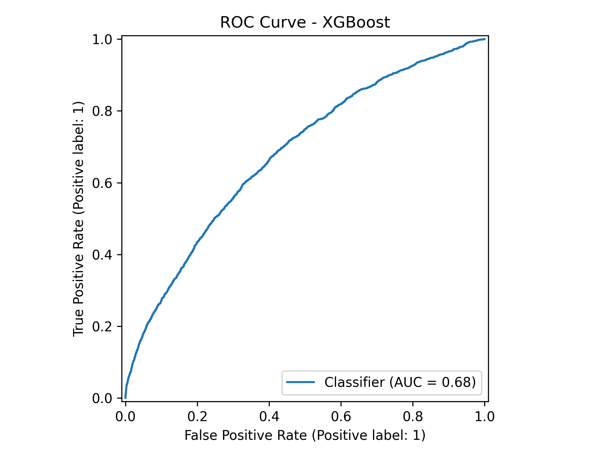
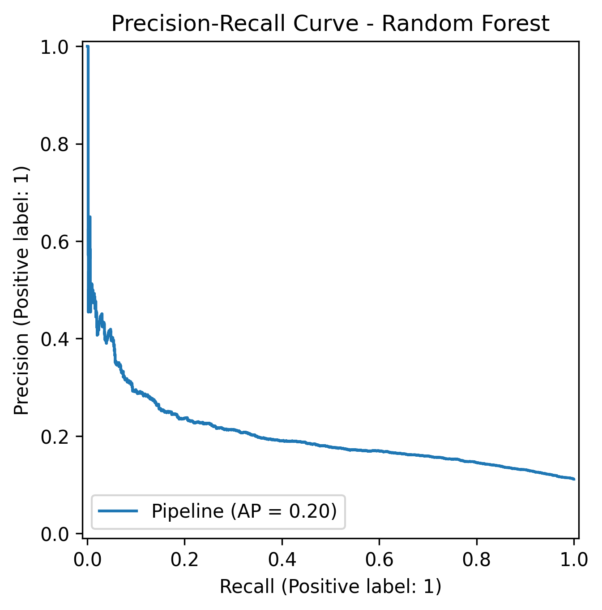
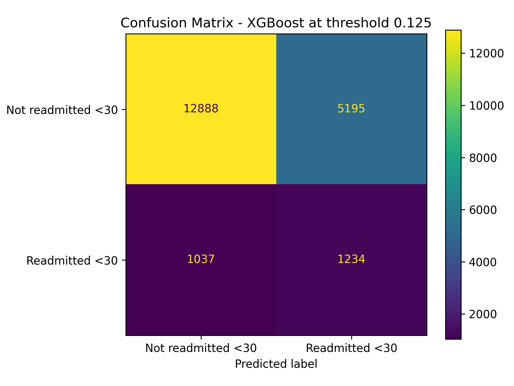

# Diabetes Readmission Risk Prediction Using Interpretable Machine Learning

## Abstract

This project evaluates the feasibility of predicting 30-day hospital readmission risk in patients with diabetes using routinely collected hospital encounter data. The analysis was designed as a reproducible health-data science study rather than a deployable clinical tool.

The project compares baseline and non-linear machine-learning models using stratified cross-validation, hyperparameter tuning, holdout evaluation, calibration analysis, threshold analysis, subgroup/fairness analysis, error analysis and model interpretability. The best model by holdout PR-AUC was **XGBoost**. Its holdout ROC-AUC was **0.680** and holdout PR-AUC was **0.231**.

The results suggest that routinely collected hospital data contains some signal associated with 30-day readmission risk, but the model is not clinically deployable without external validation, prospective testing, calibration review and fairness assessment.

## 1. Introduction

Hospital readmission is an important healthcare outcome because it can reflect disease burden, treatment complexity, care-transition quality and healthcare-system pressure. In patients with diabetes, readmission risk may be influenced by multimorbidity, medication burden, prior healthcare utilisation, acute complications and discharge planning.

Thirty-day readmission prediction is challenging because readmission is not driven by one biological mechanism alone. It is influenced by clinical, demographic, treatment-related and healthcare-system variables. Machine-learning models can identify patterns in historical healthcare data, but their usefulness depends on discrimination, calibration, threshold behaviour, subgroup performance, implementation feasibility and clinical safety (Rajkomar, Dean and Kohane, 2019; Kelly et al., 2019).

This project uses the Diabetes 130-US Hospitals for Years 1999-2008 dataset from the UCI Machine Learning Repository (Dua and Graff, 2019). The dataset was originally used in work investigating HbA1c measurement and readmission outcomes in patients with diabetes (Strack et al., 2014).

## 2. Aim and Research Question

### Aim

The aim was to build, validate, calibrate, interpret and stress-test a reproducible machine-learning pipeline for predicting 30-day readmission risk in patients with diabetes.

### Research question

Can routinely collected hospital encounter data identify patients with diabetes at higher risk of readmission within 30 days?

### Objectives

The project objectives were to:

- preprocess real-world hospital encounter data;
- define a binary 30-day readmission target;
- compare logistic regression, random forest and optional XGBoost models;
- use stratified cross-validation and hyperparameter tuning;
- evaluate discrimination using ROC-AUC and PR-AUC;
- evaluate probability calibration using Brier score and calibration curves;
- assess threshold trade-offs between precision, recall and false positives;
- assess subgroup performance by available demographic variables;
- perform error analysis to understand misclassified cases;
- interpret model behaviour using permutation importance and optional SHAP.

## 3. Dataset

The project used the Diabetes 130-US Hospitals for Years 1999-2008 dataset from the UCI Machine Learning Repository (Dua and Graff, 2019).

| Dataset characteristic | Value |
|---|---:|
| Hospital encounters | 101,766 |
| Original columns | 48 |
| Features after preprocessing | 44 |
| Prediction target | 30-day readmission |
| Positive class | Readmitted within 30 days |
| Positive class proportion | Approximately 11.2% |

The original `readmitted` variable contains three categories: `<30`, `>30` and `NO`. This project converted the task into binary classification:

| Binary class | Meaning |
|---|---|
| 1 | Readmitted within 30 days |
| 0 | Not readmitted within 30 days |

This created an imbalanced classification problem, making PR-AUC, precision, recall and threshold analysis especially important.

## 4. Methods

The write-up is also informed by established prediction-model reporting and appraisal principles. TRIPOD emphasises transparent reporting of prediction-model development and validation studies (Collins et al., 2015), while PROBAST provides a framework for considering risk of bias and applicability in prediction-model studies (Wolff et al., 2019).

The analysis was implemented in Python using pandas, NumPy, scikit-learn, Matplotlib and optional XGBoost/SHAP. Pandas was used for data handling (McKinney, 2010), NumPy for numerical operations (Harris et al., 2020), scikit-learn for modelling and evaluation (Pedregosa et al., 2011), and Matplotlib for visualisation (Hunter, 2007). Random forest was included as an ensemble baseline based on Breiman's original method (Breiman, 2001), XGBoost was included as a stronger gradient-boosting model (Chen and Guestrin, 2016), and SHAP was used for model interpretation where available (Lundberg and Lee, 2017).

### 4.1 Preprocessing

The preprocessing workflow included:

- missing-value replacement;
- removal of selected identifier, high-missingness or low-interpretability columns;
- numerical imputation and scaling;
- categorical imputation and one-hot encoding;
- stratified train-test splitting;
- class-imbalance-aware modelling.

### 4.2 Model development

Models were compared using stratified 3-fold cross-validation and hyperparameter tuning. PR-AUC was used as the refit metric because the positive class was rare and clinically important; precision-recall analysis is often more informative than ROC analysis when evaluating binary classifiers on imbalanced datasets (Saito and Rehmsmeier, 2015).

### 4.3 Models compared

The project compared the following models:

- Logistic Regression;
- Random Forest;
- XGBoost, if installed successfully.

## 5. Cross-Validation and Hyperparameter Tuning

The table below reports the best cross-validation performance for each model after hyperparameter tuning.

| model | best_cv_pr_auc_mean | best_cv_pr_auc_std | best_cv_roc_auc_mean | best_cv_roc_auc_std |
| --- | --- | --- | --- | --- |
| XGBoost | 0.215 | 0.004 | 0.670 | 0.002 |
| Logistic Regression | 0.200 | 0.006 | 0.647 | 0.004 |
| Random Forest | 0.199 | 0.004 | 0.658 | 0.004 |

This strengthens the analysis because the results are not based only on one train-test split. Reporting standard deviation also gives a basic estimate of uncertainty across folds.

## 6. Holdout Test Results

After tuning, the best model configurations were evaluated on a held-out test set.

| model | holdout_roc_auc | holdout_pr_auc | precision_threshold_0_50 | recall_threshold_0_50 | f1_threshold_0_50 | brier_score_uncalibrated |
| --- | --- | --- | --- | --- | --- | --- |
| XGBoost | 0.680 | 0.231 | 0.179 | 0.620 | 0.277 | 0.224 |
| Random Forest | 0.673 | 0.220 | 0.187 | 0.523 | 0.276 | 0.217 |
| Logistic Regression | 0.659 | 0.212 | 0.172 | 0.554 | 0.263 | 0.227 |

The best model by holdout PR-AUC was **XGBoost**. However, performance should be interpreted cautiously because even a model with moderate ROC-AUC may be clinically weak if precision, calibration or threshold behaviour are poor.

## 7. Calibration Analysis

Calibration assesses whether predicted probabilities correspond to observed outcome rates. This matters clinically because a predicted 30% risk should ideally mean that approximately 30% of similar patients experience readmission; poor calibration is a major limitation of predictive analytics in clinical settings (Van Calster et al., 2019).

| probability_type | brier_score | roc_auc | pr_auc |
| --- | --- | --- | --- |
| uncalibrated | 0.224 | 0.680 | 0.231 |
| calibrated_sigmoid | 0.094 | 0.681 | 0.232 |



A poorly calibrated model may still rank patients reasonably but produce misleading risk estimates. This means calibration must be considered before using any model for clinical risk communication.

## 8. Threshold Analysis

Threshold analysis shows how model behaviour changes when the decision threshold is adjusted.

| threshold | precision | recall | f1 | specificity | predicted_positive_rate | false_positives | false_negatives |
| --- | --- | --- | --- | --- | --- | --- | --- |
| 0.050 | 0.119 | 0.962 | 0.212 | 0.107 | 0.900 | 16140 | 86 |
| 0.075 | 0.145 | 0.837 | 0.247 | 0.380 | 0.644 | 11216 | 371 |
| 0.100 | 0.165 | 0.708 | 0.268 | 0.551 | 0.478 | 8118 | 664 |
| 0.125 | 0.192 | 0.543 | 0.284 | 0.713 | 0.316 | 5195 | 1037 |
| 0.150 | 0.218 | 0.397 | 0.281 | 0.821 | 0.203 | 3234 | 1370 |
| 0.175 | 0.238 | 0.313 | 0.270 | 0.874 | 0.147 | 2281 | 1560 |
| 0.200 | 0.269 | 0.244 | 0.256 | 0.917 | 0.101 | 1503 | 1718 |
| 0.250 | 0.350 | 0.122 | 0.180 | 0.972 | 0.039 | 512 | 1995 |
| 0.300 | 0.392 | 0.071 | 0.121 | 0.986 | 0.020 | 251 | 2109 |
| 0.400 | 0.564 | 0.014 | 0.027 | 0.999 | 0.003 | 24 | 2240 |
| 0.500 | 0.000 | 0.000 | 0.000 | 1.000 | 0.000 | 0 | 2271 |



This is clinically important because different decision thresholds imply different trade-offs. A lower threshold may identify more patients at risk but create many false positives. A higher threshold may reduce unnecessary alerts but miss more patients who are truly at risk.

## 9. Subgroup and Fairness Analysis

The subgroup analysis compared model performance across available demographic groups.

| group_type | group | n | observed_readmission_rate | predicted_positive_rate | roc_auc | precision | recall | f1 |
| --- | --- | --- | --- | --- | --- | --- | --- | --- |
| gender | Female | 10924 | 0.115 | 0.326 | 0.685 | 0.196 | 0.557 | 0.290 |
| gender | Male | 9430 | 0.108 | 0.304 | 0.676 | 0.186 | 0.527 | 0.275 |
| age | [10-20) | 130 | 0.046 | 0.069 | 0.843 | 0.333 | 0.500 | 0.400 |
| age | [20-30) | 324 | 0.133 | 0.290 | 0.832 | 0.351 | 0.767 | 0.482 |
| age | [30-40) | 725 | 0.108 | 0.241 | 0.710 | 0.211 | 0.474 | 0.292 |
| age | [40-50) | 1913 | 0.098 | 0.267 | 0.747 | 0.229 | 0.622 | 0.335 |
| age | [50-60) | 3457 | 0.087 | 0.242 | 0.703 | 0.182 | 0.505 | 0.267 |
| age | [60-70) | 4547 | 0.116 | 0.292 | 0.657 | 0.195 | 0.490 | 0.279 |
| age | [70-80) | 5234 | 0.120 | 0.353 | 0.653 | 0.190 | 0.559 | 0.283 |
| age | [80-90) | 3414 | 0.124 | 0.410 | 0.649 | 0.174 | 0.575 | 0.268 |
| age | [90-100) | 576 | 0.128 | 0.394 | 0.609 | 0.167 | 0.514 | 0.252 |
| age_band | <60 | 6583 | 0.094 | 0.247 | 0.731 | 0.210 | 0.555 | 0.305 |
| age_band | >=60 | 13771 | 0.120 | 0.349 | 0.653 | 0.186 | 0.539 | 0.276 |
| race | AfricanAmerican | 3866 | 0.112 | 0.317 | 0.673 | 0.188 | 0.535 | 0.279 |
| race | Asian | 123 | 0.081 | 0.220 | 0.551 | 0.074 | 0.200 | 0.108 |
| race | Caucasian | 15223 | 0.113 | 0.322 | 0.681 | 0.194 | 0.552 | 0.287 |
| race | Hispanic | 404 | 0.124 | 0.280 | 0.771 | 0.248 | 0.560 | 0.344 |
| race | Other | 276 | 0.072 | 0.261 | 0.701 | 0.125 | 0.450 | 0.196 |



Unequal model performance across groups would require further investigation before deployment. This analysis should be interpreted as an exploratory fairness screen rather than a full fairness audit, particularly because healthcare algorithms can reproduce or amplify structural inequities if target definitions, proxies or deployment contexts are poorly chosen (Obermeyer et al., 2019).

## 10. Error Analysis

Error analysis summarises the types of cases the model misclassified.

| prediction_group | n | mean_predicted_probability | mean_time_in_hospital | mean_num_lab_procedures | mean_num_procedures | mean_num_medications | mean_number_outpatient | mean_number_emergency | mean_number_inpatient | mean_number_diagnoses | most_common_age | most_common_gender | most_common_race | most_common_insulin | most_common_diabetesMed | most_common_discharge_disposition_id |
| --- | --- | --- | --- | --- | --- | --- | --- | --- | --- | --- | --- | --- | --- | --- | --- | --- |
| false_negative | 1037 | 0.086 | 4.218 | 43.556 | 1.291 | 15.515 | 0.312 | 0.113 | 0.158 | 7.395 | [70-80) | Female | Caucasian | No | Yes | 1 |
| false_positive | 5195 | 0.181 | 5.366 | 46.310 | 1.238 | 17.969 | 0.550 | 0.386 | 1.629 | 8.090 | [70-80) | Female | Caucasian | No | Yes | 1 |
| true_negative | 12888 | 0.077 | 3.951 | 41.596 | 1.414 | 15.082 | 0.279 | 0.080 | 0.134 | 7.100 | [70-80) | Female | Caucasian | No | Yes | 1 |
| true_positive | 1234 | 0.209 | 5.296 | 45.053 | 1.186 | 18.121 | 0.559 | 0.556 | 2.108 | 8.007 | [70-80) | Female | Caucasian | No | Yes | 1 |

False positives may create unnecessary clinical follow-up or alert fatigue. False negatives may miss patients who could benefit from additional discharge support. This trade-off means model usefulness depends on the clinical decision setting.

## 11. Interpretability

Permutation importance was used to identify features most associated with model performance.

| feature | importance_mean_pr_auc | importance_std_pr_auc |
| --- | --- | --- |
| number_inpatient | 0.093 | 0.003 |
| discharge_disposition_id | 0.021 | 0.003 |
| diag_1 | 0.014 | 0.001 |
| number_emergency | 0.007 | 0.002 |
| insulin | 0.004 | 0.000 |
| diabetesMed | 0.002 | 0.001 |
| age | 0.002 | 0.000 |
| medical_specialty | 0.002 | 0.001 |
| num_procedures | 0.002 | 0.000 |
| num_medications | 0.001 | 0.000 |
| payer_code | 0.001 | 0.001 |
| metformin | 0.001 | 0.001 |
| diag_2 | 0.001 | 0.000 |
| diag_3 | 0.000 | 0.000 |
| num_lab_procedures | 0.000 | 0.000 |



SHAP was also used as an additional model-interpretability method.



Interpretability results should not be interpreted causally. They identify features that contribute to prediction in this dataset, not variables that necessarily cause readmission.

## 12. Core Figures

### ROC curve



### Precision-recall curve



### Confusion matrix



## 13. Discussion

This project suggests that routinely collected hospital encounter data contains predictive signal for 30-day readmission risk in patients with diabetes. Prior healthcare utilisation, emergency visits, discharge disposition, diagnosis information and treatment-related variables are clinically plausible predictors because they may reflect disease burden, care-transition complexity and multimorbidity.

However, the project also shows why healthcare prediction models need more than headline discrimination metrics. A model with moderate ROC-AUC may still be clinically weak if precision is low, probabilities are poorly calibrated or subgroup performance is uneven. In this setting, false positives could create unnecessary clinical workload, while false negatives could miss patients who might benefit from additional follow-up.

The model should therefore be viewed as an exploratory health-data science pipeline, not a deployable clinical tool. This cautious interpretation is consistent with prediction-model reporting and risk-of-bias guidance, which emphasises transparent reporting, validation, calibration, applicability and bias assessment before clinical use (Collins et al., 2015; Wolff et al., 2019).

## 14. Limitations

Key limitations include:

1. The dataset is historical, covering care from 1999-2008.
2. The dataset comes from US hospitals and may not generalise to UK/NHS settings.
3. Observational data can identify associations but cannot prove causality.
4. Coding patterns may reflect healthcare-system processes rather than patient biology alone.
5. Model performance is modest.
6. Calibration and threshold behaviour require careful clinical review.
7. Subgroup analysis is exploratory and does not replace a full fairness audit.
8. External validation and prospective validation would be required before clinical use, because performance in a retrospective development dataset does not guarantee safe or useful performance in another clinical setting (Collins et al., 2015; Wolff et al., 2019).

## 15. Conclusion

This project built and stress-tested an interpretable machine-learning pipeline for predicting 30-day diabetes readmission risk. The advanced version goes beyond a simple model comparison by incorporating cross-validation, hyperparameter tuning, PR-AUC, calibration, threshold analysis, subgroup analysis, error analysis and interpretability.

The findings show that routinely collected hospital data contains some predictive signal, but the model is not suitable for clinical deployment without further validation. The main value of the project is as a rigorous, reproducible demonstration of responsible healthcare machine learning.

## 16. Medical Affairs and Health Data Science Relevance

For medical affairs, this project demonstrates how real-world evidence and predictive modelling can be translated into stakeholder-relevant insights around patient pathways, discharge planning, risk communication and implementation barriers.

For health data science, it demonstrates an end-to-end healthcare prediction workflow: data access, preprocessing, model tuning, validation, calibration, interpretability, subgroup analysis, error analysis and critical reporting.

## 17. Repository Structure

| File or folder | Description |
|---|---|
| `src/readmission_pipeline.py` | Main reproducible Python pipeline |
| `outputs/model_results.csv` | Holdout model performance |
| `outputs/cross_validation_tuning_results.csv` | Cross-validation and tuning results |
| `outputs/calibration_summary.csv` | Calibration metrics |
| `outputs/calibration_curve.png` | Calibration curve |
| `outputs/threshold_analysis.csv` | Threshold comparison table |
| `outputs/threshold_analysis.png` | Threshold analysis plot |
| `outputs/fairness_subgroup_analysis.csv` | Subgroup/fairness results |
| `outputs/error_analysis_summary.csv` | Error analysis summary |
| `outputs/feature_importance.csv` | Permutation importance results |
| `outputs/shap_top_features.csv` | Optional SHAP results |
| `briefs/technical_summary.md` | Technical summary |
| `briefs/medical_affairs_translation_brief.md` | Medical affairs brief |

## 18. Reproducibility

To run the project locally:

```bash
git clone https://github.com/tbharaj/diabetes-readmission-risk-ml.git
cd diabetes-readmission-risk-ml
python -m venv .venv
.venv\Scripts\activate
pip install -r requirements.txt
python src/readmission_pipeline.py
```

## References

Breiman, L. (2001) 'Random forests', *Machine Learning*, 45(1), pp. 5-32. doi: 10.1023/A:1010933404324.

Chen, T. and Guestrin, C. (2016) 'XGBoost: A scalable tree boosting system', *Proceedings of the 22nd ACM SIGKDD International Conference on Knowledge Discovery and Data Mining*, pp. 785-794. doi: 10.1145/2939672.2939785.

Collins, G.S., Reitsma, J.B., Altman, D.G. and Moons, K.G.M. (2015) 'Transparent Reporting of a multivariable prediction model for Individual Prognosis Or Diagnosis (TRIPOD): the TRIPOD statement', *Annals of Internal Medicine*, 162(1), pp. 55-63. doi: 10.7326/M14-0697.

Dua, D. and Graff, C. (2019) *UCI Machine Learning Repository*. Irvine, CA: University of California, School of Information and Computer Science. Available at: https://archive.ics.uci.edu/ (Accessed: 9 June 2026).

Harris, C.R., Millman, K.J., van der Walt, S.J., Gommers, R., Virtanen, P., Cournapeau, D. et al. (2020) 'Array programming with NumPy', *Nature*, 585, pp. 357-362. doi: 10.1038/s41586-020-2649-2.

Hunter, J.D. (2007) 'Matplotlib: A 2D graphics environment', *Computing in Science & Engineering*, 9(3), pp. 90-95. doi: 10.1109/MCSE.2007.55.

Kelly, C.J., Karthikesalingam, A., Suleyman, M., Corrado, G. and King, D. (2019) 'Key challenges for delivering clinical impact with artificial intelligence', *BMC Medicine*, 17, Article 195. doi: 10.1186/s12916-019-1426-2.

Lundberg, S.M. and Lee, S.-I. (2017) 'A unified approach to interpreting model predictions', *Advances in Neural Information Processing Systems*, 30, pp. 4765-4774.

McKinney, W. (2010) 'Data structures for statistical computing in Python', *Proceedings of the 9th Python in Science Conference*, pp. 56-61. doi: 10.25080/Majora-92bf1922-00a.

Obermeyer, Z., Powers, B., Vogeli, C. and Mullainathan, S. (2019) 'Dissecting racial bias in an algorithm used to manage the health of populations', *Science*, 366(6464), pp. 447-453. doi: 10.1126/science.aax2342.

Pedregosa, F., Varoquaux, G., Gramfort, A., Michel, V., Thirion, B., Grisel, O. et al. (2011) 'Scikit-learn: Machine learning in Python', *Journal of Machine Learning Research*, 12, pp. 2825-2830.

Rajkomar, A., Dean, J. and Kohane, I. (2019) 'Machine learning in medicine', *New England Journal of Medicine*, 380(14), pp. 1347-1358. doi: 10.1056/NEJMra1814259.

Saito, T. and Rehmsmeier, M. (2015) 'The precision-recall plot is more informative than the ROC plot when evaluating binary classifiers on imbalanced datasets', *PLOS ONE*, 10(3), e0118432. doi: 10.1371/journal.pone.0118432.

Strack, B., DeShazo, J.P., Gennings, C., Olmo, J.L., Ventura, S., Cios, K.J. and Clore, J.N. (2014) 'Impact of HbA1c measurement on hospital readmission rates: analysis of 70,000 clinical database patient records', *BioMed Research International*, 2014, Article ID 781670. doi: 10.1155/2014/781670.

Van Calster, B., McLernon, D.J., van Smeden, M., Wynants, L. and Steyerberg, E.W. (2019) 'Calibration: the Achilles heel of predictive analytics', *BMC Medicine*, 17, Article 230. doi: 10.1186/s12916-019-1466-7.

Wolff, R.F., Moons, K.G.M., Riley, R.D., Whiting, P.F., Westwood, M., Collins, G.S. et al. (2019) 'PROBAST: A tool to assess the risk of bias and applicability of prediction model studies', *Annals of Internal Medicine*, 170(1), pp. 51-58. doi: 10.7326/M18-1376.

## Licence

This repository is licensed under the MIT License. The licence applies only to the code and project documentation created in this repository. The original dataset is not redistributed here.
